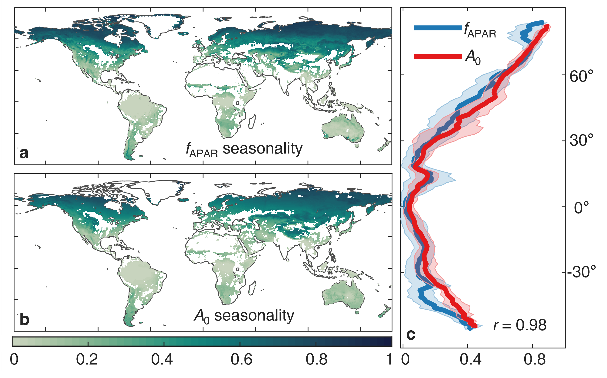

# Optimal canopy light-use strategy shapes global greenness dynamics



> *Figure 1 |* Conceptual framework and global synthesis. Plants regulate canopy architecture so that the seasonal cycle of fractional absorbed photosynthetically active radiation (fAPAR) tracks the seasonal dynamics of potential production (A₀) — the carbon uptake the canopy could sustain if all incident light were absorbed. The PL (Potential production–Leaves) model captures this synchronization with two physically interpretable parameters: a leaf allocation fraction (η) and a phenological lag (τ) that grows with moisture limitation.

This repository hosts the data, code, and figures supporting the manuscript **"Optimal canopy light-use strategy shapes global greenness dynamics"** (Zhu et al., *Nature Communications*, 2026; manuscript ID: **NCOMMS-25-24941B**). The accompanying workflow regenerates all main figures from packaged inputs and reproduces the central finding: **light and environmentally regulated biophysical constraints jointly shape global patterns of vegetation greenness, its seasonal cycle, and its recent increase.**

---

## Contents
- [Title & Authors](#title--authors)
- [Abstract](#abstract)
- [Key Idea: the Synchronization Hypothesis](#key-idea-the-synchronization-hypothesis)
- [Highlights](#highlights)
- [Repository Layout](#repository-layout)
- [Data Inventory](#data-inventory)
- [System Requirements](#system-requirements)
- [Setup Guide](#setup-guide)
- [Running the Workflow](#running-the-workflow)
- [Results & Figures](#results--figures)
- [Support](#support)
- [Citation](#citation)
- [License](#license)

---

## Title & Authors

**Optimal canopy light-use strategy shapes global greenness dynamics**

Ziqi Zhu (朱子琪)¹·², Han Wang (王焓)¹·*, Boya Zhou (周博雅)³, Wenjia Cai (蔡文佳)³, Sandy P. Harrison⁴·¹, Martin G. De Kauwe⁵, I. Colin Prentice³·¹

¹ Department of Earth System Science, Ministry of Education Key Laboratory for Earth System Modelling, Institute for Global Change Studies, Tsinghua University, Beijing 100084, China
² State Key Laboratory of Space Information System and Integrated Application, Beijing 100086, China
³ Georgina Mace Centre for the Living Planet, Department of Life Sciences, Imperial College London, Silwood Park Campus, Buckhurst Road, Ascot SL5 7PY, United Kingdom
⁴ School of Archaeology, Geography and Environmental Sciences (SAGES), University of Reading, Reading RG6 6AH, United Kingdom
⁵ School of Biological Sciences, University of Bristol, Bristol, BS8 1TQ, United Kingdom

\* **Corresponding author:** Han Wang — `wang_han@tsinghua.edu.cn`

---

## Abstract

"Greenness" is a key indicator of the functional state of vegetation. However, the physiological processes behind seasonal patterns in greenness are diverse and incompletely understood, hindering the predictability of climate-driven shifts in global foliage phenology. Optimality principles suggest that plants invest in canopy architecture to maximize light capture. Therefore, we hypothesize that, irrespective of specific physiological mechanisms, greenness (fAPAR: fractional canopy light absorption) commonly tracks the seasonal dynamics of potential production (A₀: theoretical canopy carbon uptake with all light absorbed). In other words, **plants tend to display foliage when it is most productive.** We show that observations confirm this hypothesis and develop a model predicting fAPAR from the seasonal cycle of A₀, with a phenological lag that increases (from 2 weeks to 3 months) with increasing moisture limitation. This model **captures 81% of observed variations in fAPAR** and shows that light and environmentally regulated biophysical constraints shape global patterns of vegetation greenness, its seasonal cycle, and its recent increase.

---

## Key Idea: the Synchronization Hypothesis

Vegetation canopies can be described by two complementary quantities:

- **fAPAR** — the fraction of incident photosynthetically active radiation that is actually absorbed by leaves; a structural property set by canopy architecture and leaf area.
- **A₀** — *potential* canopy carbon uptake, i.e. what the canopy could fix if all incident light were absorbed; set by incident PAR, light-use efficiency, and leaf-level biochemical capacities.

Under the classical light-use-efficiency framework, GPP = fAPAR × A₀. We propose a general **synchronization hypothesis**, grounded in Eco-Evolutionary Optimality (EEO): *plants use available light efficiently, irrespective of PFT-specific mechanisms, by regulating foliage cover so that fAPAR changes in concert with the seasonal dynamics of A₀.* Foliage is displayed when it is most productive, and withdrawn when it would not pay for itself.

The resulting **PL model** predicts monthly fAPAR directly from the climate-driven seasonal cycle of A₀, with two physically interpretable parameters:

| Symbol | Quantity | Interpretation |
| --- | --- | --- |
| η | Leaf allocation fraction | Inherent fraction of photosynthate devoted to building/maintaining leaves |
| τ | Phenological lag | Time required for photosynthetic products to be synthesized, transported, and allocated to growth |

Both η and τ are estimated as functions of the environment, providing a PFT-agnostic, process-based alternative to empirical phenology schemes (growing-degree days, photoperiod, etc.).

---

## Highlights

- A simple, general, PFT-agnostic model that reproduces observed seasonal greenness across biomes.
- Predicts fAPAR directly from the seasonal cycle of potential production A₀.
- Explains 81% of observed monthly fAPAR variations globally.
- A phenological lag (τ) emerges from carbon allocation constraints and grows systematically with moisture limitation (2 weeks → 3 months).
- Reconciles satellite (MODIS), eddy-covariance flux-tower, and TRENDY land-surface-model evidence within a single optimality framework.
- Successfully reproduces historical fAPAR and GPP trends during the satellite era.

---

## Repository Layout

```
greenness/
├── code/                    # MATLAB scripts to regenerate manuscript figures
│   ├── main_figures_ncomms.m
│   ├── main_figures_ncomms.mlx
│   ├── readme.txt
│   └── utility/             # Plotting and statistical helpers
│       ├── geoshow_global.m
│       ├── plot_lat_bands.mlx
│       ├── scatter_plot_data_comparison.m
│       ├── shadedErrorBar.m
│       ├── violinplot.m
│       └── ... (colorbrewer, statistics, etc.)
├── data/                    # Packaged inputs (rasters, tables, TRENDY diagnostics)
│   ├── FluxInformation.csv
│   ├── fapar_global_*.tif
│   ├── a0_global_plmodel_05d.tif
│   ├── gpp_global_pgc.mat
│   ├── trendy_data_output.mat
│   ├── trendy_param_output.mat
│   └── ...
├── figure/                  # Default export directory (created by the workflow)
│   ├── Figure1.png          # Conceptual framework (shown above)
│   ├── Figure2.png ... Figure6.png
│   ├── Seasonality_Pattern.png
│   ├── spatial_compare.png
│   ├── fAPARtrend_pvalue.png
│   ├── GPPtrend_series.png
│   └── ...
└── README.md
```

---

## Data Inventory

| File | Description | Used in |
| --- | --- | --- |
| `FluxInformation.csv` | Flux-tower metadata and biome classes for Figure 2 site diagnostics. | `main_figures_ncomms.m` |
| `gpp_global_pgc.mat` | Annual global GPP totals for PL simulations. | `main_figures_ncomms.m` |
| `trendy_data_output.mat` | TRENDY ensemble seasonal diagnostics. | `main_figures_ncomms.m` |
| `trendy_param_output.mat` | TRENDY model performance summary metrics. | `main_figures_ncomms.m` |
| `trendy_data_output_gpp.mat` | TRENDY ensemble GPP diagnostics. | `main_figures_ncomms.m` |
| `trendy_param_output_gpp.mat` | TRENDY ensemble GPP performance metrics. | `main_figures_ncomms.m` |
| `fapar_global_modis_05d.tif` | MODIS fAPAR climatology (0.5°). | `main_figures_ncomms.m` |
| `fapar_global_plmodel_05d.tif` | PL-model simulated fAPAR climatology (0.5°). | `main_figures_ncomms.m` |
| `a0_global_plmodel_05d.tif` | Potential production A₀ used to drive PL (0.5°). | `main_figures_ncomms.m` |
| `roi_global_05d.tif` | Region-of-interest / land mask (0.5°). | `main_figures_ncomms.m` |
| `fapar_trend_global_plmodel_05d.tif` | PL-simulated fAPAR trend field. | `main_figures_ncomms.m` |
| `fapar_trendy_plmodel_05d.tif` | TRENDY-simulated fAPAR trend field. | `main_figures_ncomms.m` |

All packaged assets in `data/` are referenced by `code/main_figures_ncomms.m`; the GeoTIFF stacks and `roi_global_05d.tif` must remain alongside these files for the workflow to complete.

---

## System Requirements

- **Software:** MATLAB R2021b (or newer) with the Mapping Toolbox.
- **Operating System:** Windows or macOS tested; Linux should also work when the Mapping Toolbox is available.
- **Hardware:** ≥ 16 GB RAM recommended for manipulating global GeoTIFF stacks.

---

## Setup Guide

1. Clone or download the repository and keep the directory structure intact.
2. Ensure the `data/` folder contains the GeoTIFF and MAT assets distributed with the project.
3. Launch MATLAB and set the current folder to the repository's `code/` directory.
4. Verify that the `utility/` subfolder is on the MATLAB path (the main script automatically adds it).

---

## Running the Workflow

1. Open `main_figures_ncomms.m` in MATLAB.
2. Confirm that `../data/` resolves to the packaged inputs and that `../figure/` is writable.
3. Run the entire script (Section Run or the **Run** button). Execution will sequentially:
   - Load gridded greenness and potential-production stacks.
   - Generate the seasonality, flux-site synchrony, spatial comparison, and trend panels.
   - Export publication-ready figures to `figure/` at 600 dpi.
4. Review the exported PNG files and, if needed, adjust figure aesthetics directly in the script.

---

## Results & Figures

The workflow writes the following assets to `figure/`:

| File | Description |
| --- | --- |
| `Figure1.png` | Conceptual framework and global synthesis (shown above). |
| `Seasonality_Pattern_A0.png` | Global MODIS vs. PL seasonality maps with latitude-band summary. |
| `spatial_compare.png` | Multi-year PL and MODIS climatology maps plus latitudinal comparison. |
| `Seasonality_Pattern.png` | Vertical stack comparing MODIS, TRENDY, and PL seasonal concentration. |
| `FluxSynchrony_Map.png` / `FluxSynchrony_Box.png` | Eddy-covariance flux-tower fAPAR–A₀ synchrony diagnostics (Figure 2). |
| `Trendy_Performance.png` | TRENDY ensemble performance benchmark. |
| `fAPARtrend_pvalue.png` | Observed and simulated greenness trends with significance masking. |
| `fAPARtrend_pvalue_nolabel.png` | Same panel without labels, for layout flexibility. |
| `fAPARtrend_driver_attribution.png` | Driver-attribution panel for fAPAR trends. |
| `GPPtrend_series.png` | Global GPP trajectories for TRENDY, PL, and the A₀-only experiment. |
| `FigS_Trend_Scenariosctrl.png` | Supplementary trend-scenario control panel. |
| `spatial_compare_density.png` | Density plot of PL vs. MODIS fAPAR. |

---

## Support

Please open a discussion or issue in your collaboration space if you encounter missing data, plotting errors, or require additional diagnostics. Include MATLAB version details and any console warnings to accelerate troubleshooting.

---

## Citation

If you use this code, data, or figures, please cite the original article:

> **Zhu, Z., Wang, H., Zhou, B., Cai, W., Harrison, S. P., De Kauwe, M. G., & Prentice, I. C.** (2026). *Optimal canopy light-use strategy shapes global greenness dynamics.* **Nature Communications** (manuscript ID: NCOMMS-25-24941B).

A BibTeX entry will be provided once the article receives its final volume/page numbers.

---

## License

Code in this repository is released for academic, non-commercial reuse. Data assets bundled in `data/` are redistributed under the terms of their original providers (MODIS, flux-tower PIs, TRENDY participants); please cite those sources accordingly when redistributing derived products.